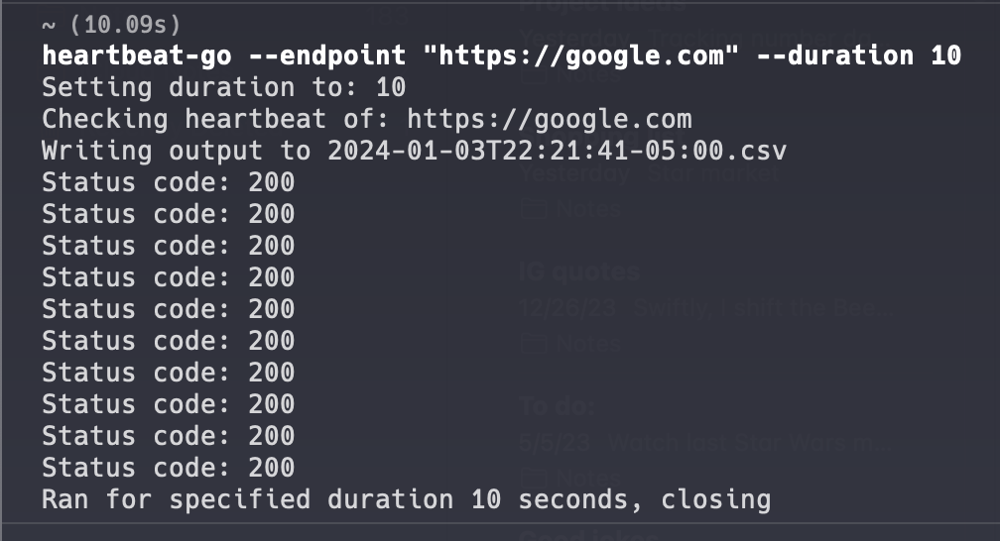
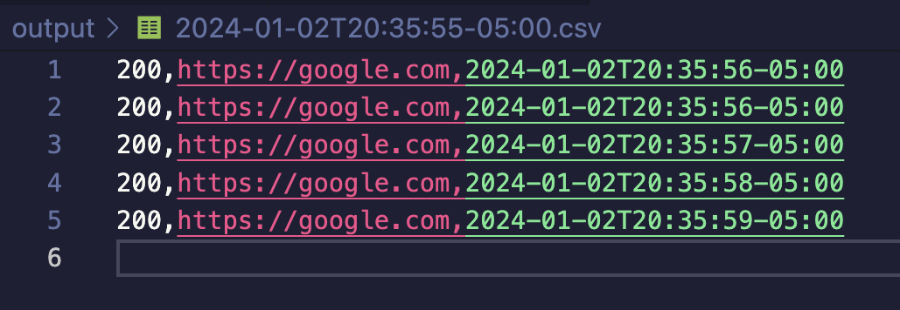

Heartbeat service written in go. Continuously polls the endpoint for a given duration. Saves output to a CSV (Status, endpoint, UTC timestamp).

I have basically no idea what I'm doing but it works I guess 

Example usage: `heartbeat --endpoint https://google.com --duration 10`
- Endpoint is the FQDN you'd like to check the heartbeat of
- Duration in seconds to query for (optional). Default is 600s

